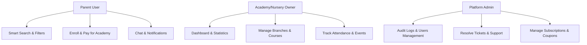
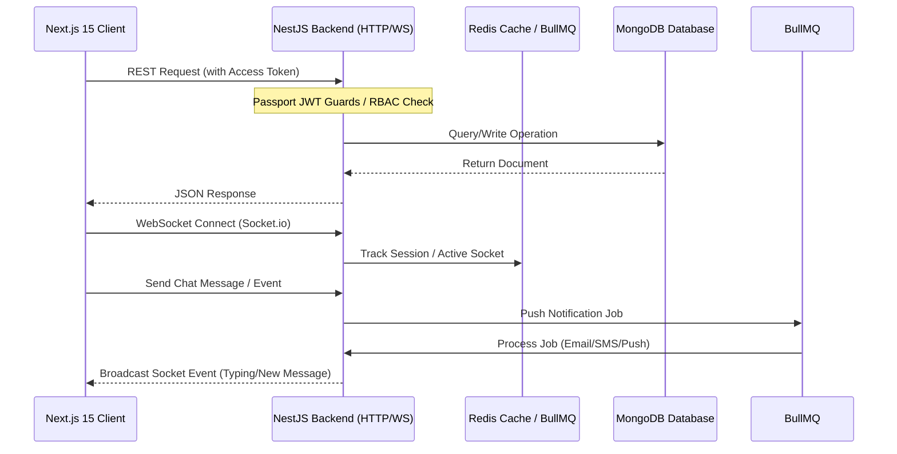
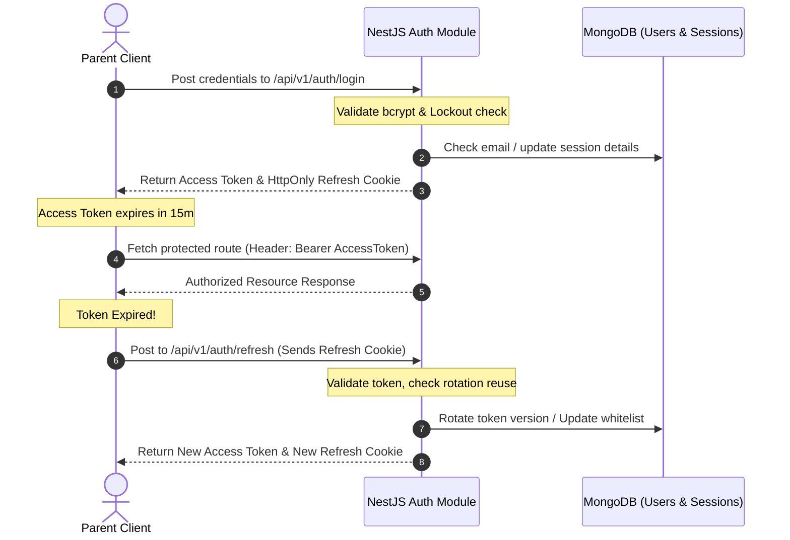

# Product Requirements & System Architecture

This document describes the complete Product Requirements Document (PRD), threat model, overall system architecture, and real-time interaction flows for the upgraded enterprise-grade **Kids-Oasis** application.

---

## 1. Product Requirements Document (PRD)

### 1.1 Objective
Kids-Oasis is a robust discovery, reservation, and management platform connecting parents with children's nurseries and academies. The platform provides:
1. **Parents**: Tools to search, filter, compare, book sessions, enroll children, track progress, review services, and converse directly with academies.
2. **Academies/Nurseries**: Management panels to control branches, courses, teachers, check student attendance, calculate revenue, track occupancy, handle payments, and manage events.
3. **Admins**: Comprehensive system dashboard to manage users, resolve tickets, review logs, configure coupons, and view platform analytics.

### 1.2 User Personas & Core Journeys

#### User Journeys:
- **Parent Discovery & Enrollment Journey**:
  - Registers, verifies email, logs in, logs child details (age, preferences).
  - Uses smart filters (age, budget, curriculum) to search nurseries.
  - Receives AI recommendations based on child details, ratings, and location proximity.
  - Submits a booking/enrollment request and completes payment.
  - Receives email/socket confirmation and can chat with the academy.
- **Academy Owner Journey**:
  - Signs up, creates an Academy Profile, sets up branches, teachers, and courses.
  - Manages incoming bookings, validates payments, and inputs student attendance.
  - Views real-time occupancy statistics, monthly enrollments, and revenue metrics.
- **Admin System Management**:
  - Audits logs, configures system coefficients, monitors system health (Redis queues, BullMQ status).
  - Addresses reported support tickets.

---

## 2. System Architecture

Kids-Oasis follows a decoupled modular monorepo architecture:

### 2.1 Backend Layer (NestJS)
- Modular design following SOLID principles.
- Decoupled database interaction via repositories.
- REST API layer versioned under `/api/v1`.
- Socket.io gateway for real-time notifications, counter increments, and chat.
- Redis server caching frequently read profiles and routes, backed by BullMQ task manager handling emails, notification workers, and audit logging.

### 2.2 Frontend Layer (Next.js 15)
- App Router layout structure leveraging Server Components (RSC) for initial page loads and Client Components for dynamic dashboards.
- Redux Toolkit & Redux Persist for global client states (theme, auth tokens, cached preferences).
- TanStack Query (React Query) for optimistic UI updates, data fetching, and automated retry patterns.
- Framer Motion for premium, fluid animations (specifically matching the native feel of the landing page, signup widgets, and filter drawers).

---

## 3. Authentication & JWT Rotation Flow

Authentication is managed strictly by the NestJS backend (no Clerk dependencies):

### 3.1 Security Measures & Policies:
- **HttpOnly Cookies**: Refresh tokens are stored in secure, HttpOnly, SameSite=Strict cookies to protect against XSS token stealing.
- **Refresh Token Rotation (RTR)**: Each refresh token is single-use. If a token is reused (indicating a potential breach), the entire session family is instantly invalidated, forcing all active devices to logout.
- **Account Lockout**: After 5 failed password attempts, the user account is locked for 15 minutes. Lock states are tracked in Redis for high-speed invalidation.
- **CSRF Protection**: Access tokens are supplied as bearer headers, making CSRF attempts on state-changing REST actions impossible.
- **Google OAuth 2.0**: Handled via Passport-Google strategy. On successful callback, the user profile is linked, and JWT credentials are generated.

---

## 4. Threat Model & Security Controls

| Threat Vector | Potential Impact | Security Control Implemented |
| :--- | :--- | :--- |
| **Cross-Site Scripting (XSS)** | Token theft, API hijacking | JWT Access Token kept in memory; Refresh Token kept in HttpOnly, Secure, SameSite=Strict cookie. Content Security Policies (CSP) configured via Helmet. |
| **CSRF** | Unauthorized actions (e.g. transfers, bookings) | State-changing endpoints require Bearer JWT token in Authorization Header (not cookies). |
| **Brute Force Attacks** | Password guessing / account takeover | Redis-backed Express Rate Limiter configured per IP/route. Account lockout schema enforced after 5 consecutive failure attempts. |
| **Data Sniffing** | Token & personal data leakage in transit | Force SSL/TLS protocols. Strict-Transport-Security (HSTS) headers set via NestJS security middleware. |
| **SQL/NoSQL Injections** | Database read/write/drop exploits | Strong validation pipes using class-validator and class-transformer. MongoDB queries parameterized via Mongoose models. |
| **Denial of Service (DoS)** | Application downtime | Connection rate limiting, Node compression middleware, payload limit checks in Multer config. |
