# 🌴 Kids Oasis — Enterprise Education Marketplace & Academy Management Platform

> **"Professional for parents. Friendly for children. Enterprise for academy owners."**
> A FAANG-grade education marketplace connecting parents with nurseries, preschools, sports academies, language institutes, STEM/coding centers, and arts programs.

[](https://kids-oasis-platform.vercel.app)
[](https://kids-oasis-api.vercel.app/swagger)
[](https://nextjs.org)
[](https://nestjs.com)
[](https://mongodb.com)
[](https://stripe.com)

---

## 📋 Table of Contents

1. [Product Overview](#-product-overview)
2. [System Architecture](#-system-architecture)
3. [Tech Stack](#-tech-stack)
4. [User Roles & Authority Matrix](#-user-roles--authority-matrix)
5. [Feature Matrix by Role](#-feature-matrix-by-role)
6. [API Endpoints](#-api-endpoints)
7. [User Journey Diagrams](#-user-journey-diagrams)
8. [Platform Charts & Metrics](#-platform-charts--metrics)
9. [Data Models](#-data-models)
10. [Security Architecture](#-security-architecture)
11. [Deployment & CI/CD](#-deployment--cicd)
12. [Environment Variables](#-environment-variables)
13. [Local Development](#-local-development)
14. [Project Structure](#-project-structure)

---

## 🎯 Product Overview

Kids Oasis is a **dual-sided marketplace** and **SaaS academy management platform** built for the Egyptian and MENA education market. It connects parents searching for quality education with nurseries, preschools, sports academies, language institutes, and STEM centers.

```
┌─────────────────────────────────────────────────────────────────────┐
│                          KIDS OASIS                                 │
│                                                                     │
│  👨‍👩‍👧  PARENTS           🏫  ACADEMIES           👩‍🏫  TEACHERS          │
│  ──────────────     ──────────────────     ─────────────────      │
│  Discover           Manage enrollment       View class roster       │
│  Compare            Track payments          Communicate parents     │
│  Book visits        Analytics & KPIs        Access schedules        │
│  Enroll children    Staff management        Mark attendance          │
│  Pay tuition        Branch operations                               │
│  Chat directly      Review management                               │
└─────────────────────────────────────────────────────────────────────┘
```

---

## 🏗️ System Architecture

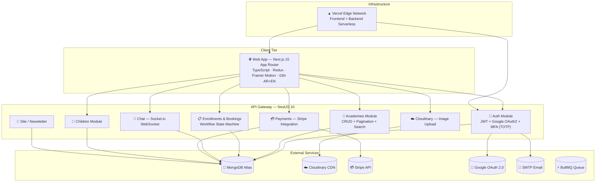

---

## 🔄 Request Flow Diagram

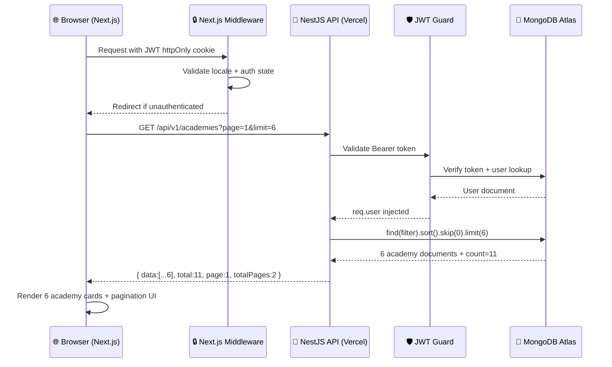

---

## 💻 Tech Stack

### Frontend
| Layer | Technology | Version |
|-------|-----------|---------|
| Framework | **Next.js App Router** | 15.5 |
| Language | **TypeScript** | 5.x |
| Styling | **Vanilla CSS** + CSS Custom Properties | — |
| Animation | **Framer Motion** | 11.x |
| State Management | **Redux Toolkit** | 2.x |
| Internationalization | **next-intl** (Arabic RTL + English) | 3.x |
| Authentication | **JWT Cookies + Google OAuth 2.0** | — |
| HTTP Client | **Axios** with AbortController | 1.x |
| Icons | **Lucide React** | 0.x |
| UI Components | **shadcn/ui** | — |
| Search Debounce | **use-debounce** | 5.x |

### Backend
| Layer | Technology | Version |
|-------|-----------|---------|
| Framework | **NestJS** | 10.x |
| Language | **TypeScript** | 5.9 |
| Database ODM | **Mongoose** + MongoDB | 8.x |
| Authentication | **Passport.js** (Local + JWT + Google) | — |
| Payments | **Stripe** SDK | — |
| Real-time | **Socket.io** WebSocket Gateway | — |
| Media Upload | **Cloudinary** SDK | — |
| Security | **Helmet**, **express-rate-limit**, **bcrypt** | — |
| API Documentation | **Swagger / OpenAPI 3.0** | — |
| Job Queue | **BullMQ** | — |
| MFA | **speakeasy** TOTP + **qrcode** | — |
| Validation | **class-validator** + **class-transformer** | — |

### Infrastructure
| Service | Provider | Purpose |
|---------|----------|---------|
| Frontend Hosting | **Vercel** Edge Network | Next.js serverless |
| Backend Hosting | **Vercel** Serverless Functions | NestJS API |
| Database | **MongoDB Atlas** | Primary data store |
| CDN / Media | **Cloudinary** | Image storage & optimization |
| Payments | **Stripe** | Payment processing |
| OAuth | **Google Cloud Console** | Social login |

---

## 👥 User Roles & Authority Matrix

### Role Hierarchy

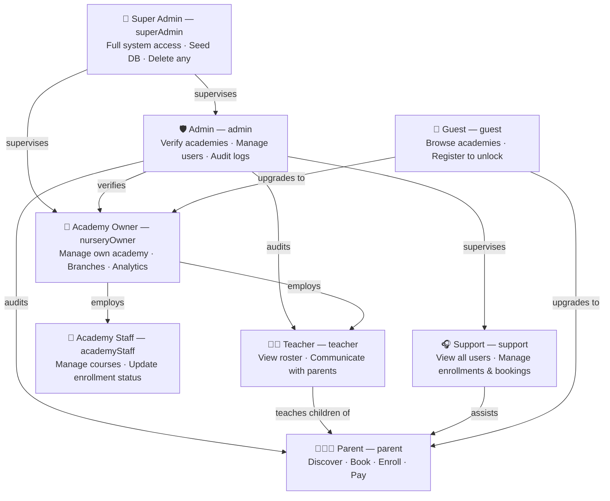

### Authority Matrix

| Permission | Guest | Parent | Teacher | Staff | Owner | Support | Admin | SuperAdmin |
|---|:---:|:---:|:---:|:---:|:---:|:---:|:---:|:---:|
| Browse academies | ✅ | ✅ | ✅ | ✅ | ✅ | ✅ | ✅ | ✅ |
| View academy detail | ✅ | ✅ | ✅ | ✅ | ✅ | ✅ | ✅ | ✅ |
| Register / Login | ✅ | ✅ | ✅ | ✅ | ✅ | ✅ | ✅ | ✅ |
| Google OAuth SSO | ✅ | ✅ | ✅ | ✅ | ✅ | ✅ | ✅ | ✅ |
| Forgot/reset password | ✅ | ✅ | ✅ | ✅ | ✅ | ✅ | ✅ | ✅ |
| Manage own profile | ❌ | ✅ | ✅ | ✅ | ✅ | ✅ | ✅ | ✅ |
| Upload avatar / media | ❌ | ✅ | ✅ | ✅ | ✅ | ❌ | ✅ | ✅ |
| Enable / disable MFA | ❌ | ✅ | ✅ | ✅ | ✅ | ✅ | ✅ | ✅ |
| Add child profiles | ❌ | ✅ | ❌ | ❌ | ❌ | ❌ | ✅ | ✅ |
| Delete child profiles | ❌ | ✅ | ❌ | ❌ | ❌ | ❌ | ✅ | ✅ |
| Book academy visit | ❌ | ✅ | ❌ | ❌ | ❌ | ❌ | ✅ | ✅ |
| Enroll child in program | ❌ | ✅ | ❌ | ❌ | ❌ | ❌ | ✅ | ✅ |
| Make payments (Stripe) | ❌ | ✅ | ❌ | ❌ | ❌ | ❌ | ✅ | ✅ |
| View own payment history | ❌ | ✅ | ❌ | ❌ | ✅ | ❌ | ✅ | ✅ |
| Write academy review | ❌ | ✅ | ❌ | ❌ | ❌ | ❌ | ✅ | ✅ |
| Chat / messaging | ❌ | ✅ | ✅ | ✅ | ✅ | ✅ | ✅ | ✅ |
| View student roster | ❌ | ❌ | ✅ | ✅ | ✅ | ❌ | ✅ | ✅ |
| Create / edit courses | ❌ | ❌ | ❌ | ✅ | ✅ | ❌ | ✅ | ✅ |
| Update enrollment status | ❌ | ❌ | ❌ | ✅ | ✅ | ✅ | ✅ | ✅ |
| Update booking status | ❌ | ❌ | ❌ | ✅ | ✅ | ✅ | ✅ | ✅ |
| Manage own academy | ❌ | ❌ | ❌ | ❌ | ✅ | ❌ | ✅ | ✅ |
| Create academy branches | ❌ | ❌ | ❌ | ❌ | ✅ | ❌ | ✅ | ✅ |
| View academy analytics | ❌ | ❌ | ❌ | ❌ | ✅ | ❌ | ✅ | ✅ |
| View all users | ❌ | ❌ | ❌ | ❌ | ❌ | ✅ | ✅ | ✅ |
| View all enrollments | ❌ | ❌ | ❌ | ❌ | ❌ | ✅ | ✅ | ✅ |
| Verify / suspend academies | ❌ | ❌ | ❌ | ❌ | ❌ | ❌ | ✅ | ✅ |
| Access audit logs | ❌ | ❌ | ❌ | ❌ | ❌ | ❌ | ✅ | ✅ |
| Manage newsletter | ❌ | ❌ | ❌ | ❌ | ❌ | ❌ | ✅ | ✅ |
| Change any user role | ❌ | ❌ | ❌ | ❌ | ❌ | ❌ | ✅ | ✅ |
| Seed database | ❌ | ❌ | ❌ | ❌ | ❌ | ❌ | ❌ | ✅ |
| Delete any record | ❌ | ❌ | ❌ | ❌ | ❌ | ❌ | ❌ | ✅ |

---

## 🎛️ Feature Matrix by Role

### 👨‍👩‍👧 Parent — `/dashboard/parent`

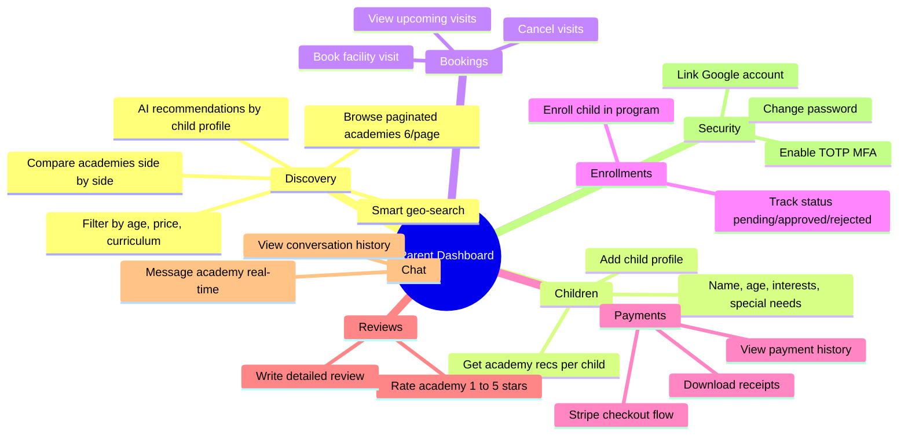

### 🏫 Academy Owner — `/dashboard/academy`

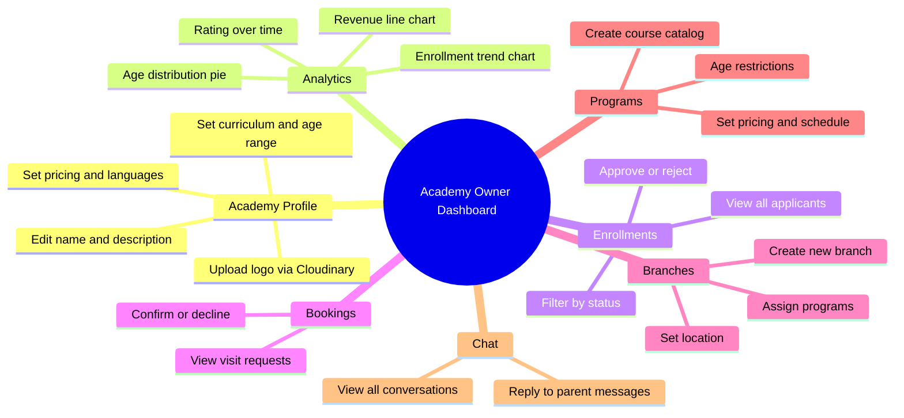

### 👩‍🏫 Teacher — `/dashboard/teacher`

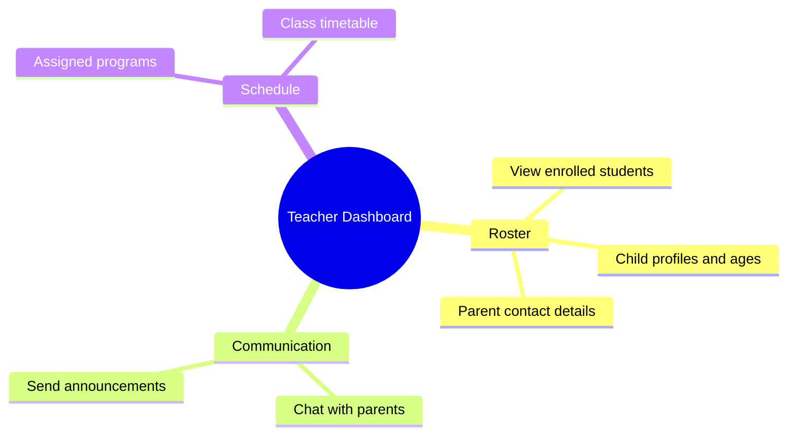

### 🛡️ Admin — `/dashboard/admin`

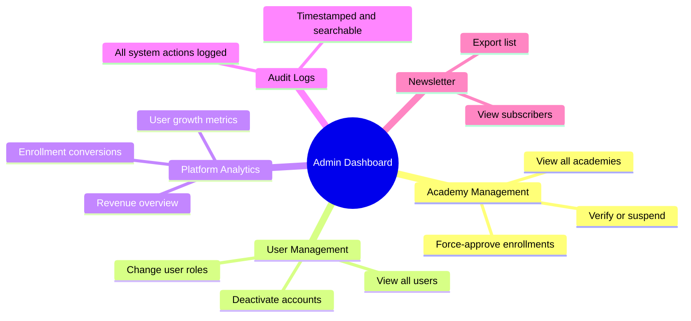

---

## 📡 API Endpoints

### 🔐 Auth — `/api/v1/auth`

| Method | Endpoint | Auth | Description |
|--------|----------|:---:|-------------|
| POST | `/register` | Public | Register email + password |
| POST | `/login` | Public | Login with MFA support |
| POST | `/refresh` | Cookie | Rotate JWT tokens |
| POST | `/logout` | JWT | Invalidate session |
| POST | `/logout-all` | JWT | Invalidate all sessions |
| POST | `/forgot-password` | Public | Send reset email |
| POST | `/reset-password` | Public | Reset via email token |
| POST | `/change-password` | JWT | Change password |
| GET | `/me` | JWT | Get current user profile |
| POST | `/mfa/generate` | JWT | Generate TOTP QR code |
| POST | `/mfa/verify` | JWT | Enable MFA |
| POST | `/mfa/disable` | JWT | Disable MFA |
| POST | `/mfa/validate` | JWT | Validate TOTP at login |
| GET | `/google` | Public | Initiate Google OAuth |
| GET | `/google/callback` | OAuth | OAuth callback handler |

### 🏫 Academies — `/api/v1/academies`

| Method | Endpoint | Auth | Description |
|--------|----------|:---:|-------------|
| GET | `/` | Public | Paginated: `?page=1&limit=6&search=&minPrice=&maxPrice=` |
| GET | `/:id` | Public | Academy detail + reviews |
| GET | `/owner/me` | JWT | Owner's academies |
| POST | `/` | JWT | Create academy |
| PATCH | `/:id` | JWT | Update academy |
| PATCH | `/:id/verify` | Admin | Toggle verified badge |
| POST | `/branch` | JWT | Create branch |
| POST | `/course` | JWT | Create course/program |
| GET | `/search` | Public | Geo-search |
| GET | `/recommend` | Public | AI recommendations |
| POST | `/:id/reviews` | JWT | Submit review |

### 👶 Children — `/api/v1/children`

| Method | Endpoint | Auth | Description |
|--------|----------|:---:|-------------|
| GET | `/` | JWT | Role-filtered children list |
| POST | `/` | JWT | Create child profile |
| PUT | `/:id` | JWT | Update child profile |
| DELETE | `/:id` | JWT | Delete child |
| GET | `/:id/recommendations` | JWT | AI recs for child |

### 📅 Bookings — `/api/v1/bookings`

| Method | Endpoint | Auth | Description |
|--------|----------|:---:|-------------|
| POST | `/bookings` | JWT | Book visit |
| GET | `/bookings` | JWT | Get bookings (role-filtered) |
| PATCH | `/bookings/:id/status` | JWT | Update booking status |

### 📋 Enrollments — `/api/v1/enrollments`

| Method | Endpoint | Auth | Description |
|--------|----------|:---:|-------------|
| POST | `/enrollments` | JWT | Submit enrollment |
| GET | `/enrollments` | JWT | Get enrollments (role-filtered) |
| PUT | `/enrollments/:id` | JWT | Update enrollment |
| PATCH | `/enrollments/:id/status` | JWT | Update status |

### 💳 Payments — `/api/v1/payments`

| Method | Endpoint | Auth | Description |
|--------|----------|:---:|-------------|
| POST | `/create-intent` | JWT | Create Stripe PaymentIntent |
| POST | `/confirm` | JWT | Confirm payment |
| GET | `/history` | JWT | Payment history |

### 💬 Chat — `/api/v1/chat`

| Method | Endpoint | Auth | Description |
|--------|----------|:---:|-------------|
| POST | `/conversation` | JWT | Start conversation |
| GET | `/conversations` | JWT | List conversations |
| GET | `/messages/:id` | JWT | Get messages |

#### WebSocket Events

| Event | Direction | Description |
|-------|-----------|-------------|
| `joinRoom` | Client → Server | Join conversation room |
| `sendMessage` | Client → Server | Send message |
| `message` | Server → Client | Receive message |
| `typing` | Client → Server | Typing indicator |

### ☁️ Media — `/api/v1/cloudinary`

| Method | Endpoint | Auth | Description |
|--------|----------|:---:|-------------|
| POST | `/upload` | JWT | Upload image file |
| POST | `/upload-base64` | JWT | Upload base64 image |

### 📧 Newsletter — `/api/v1/newsletter`

| Method | Endpoint | Auth | Description |
|--------|----------|:---:|-------------|
| POST | `/subscribe` | Public | Subscribe email |
| GET | `/` | Admin | View all subscribers |

---

## 🗺️ User Journey Diagrams

### Parent Full Journey

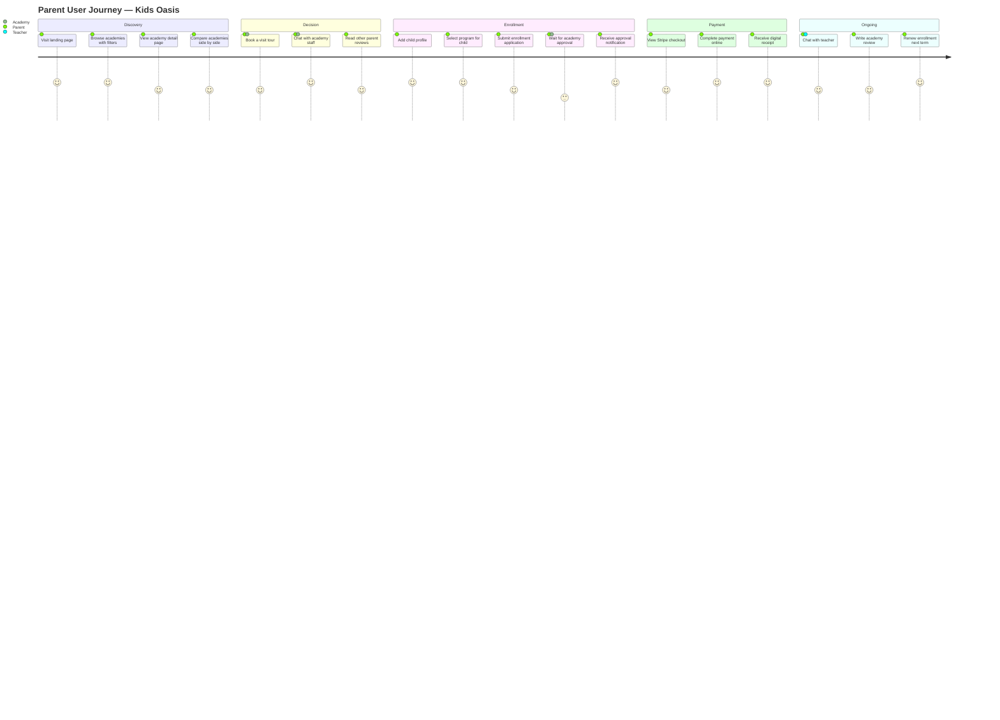

### Authentication Flow

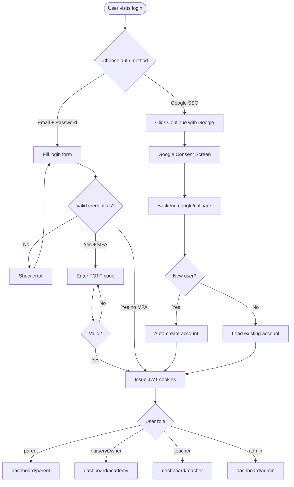

### Enrollment State Machine

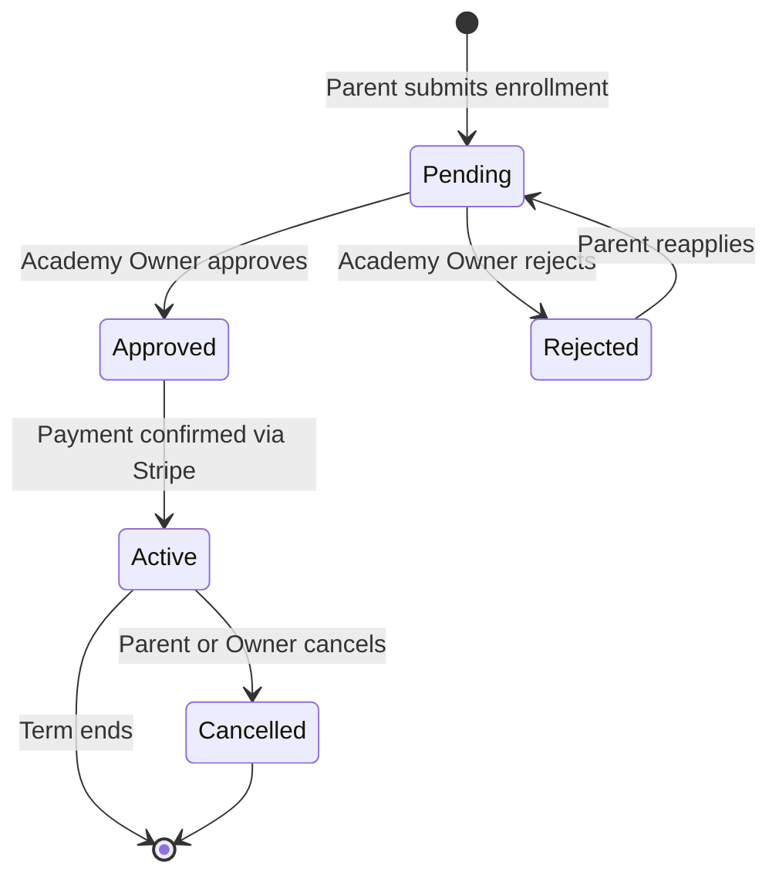

---

## 📊 Platform Charts & Metrics

### Monthly Enrollment Trends

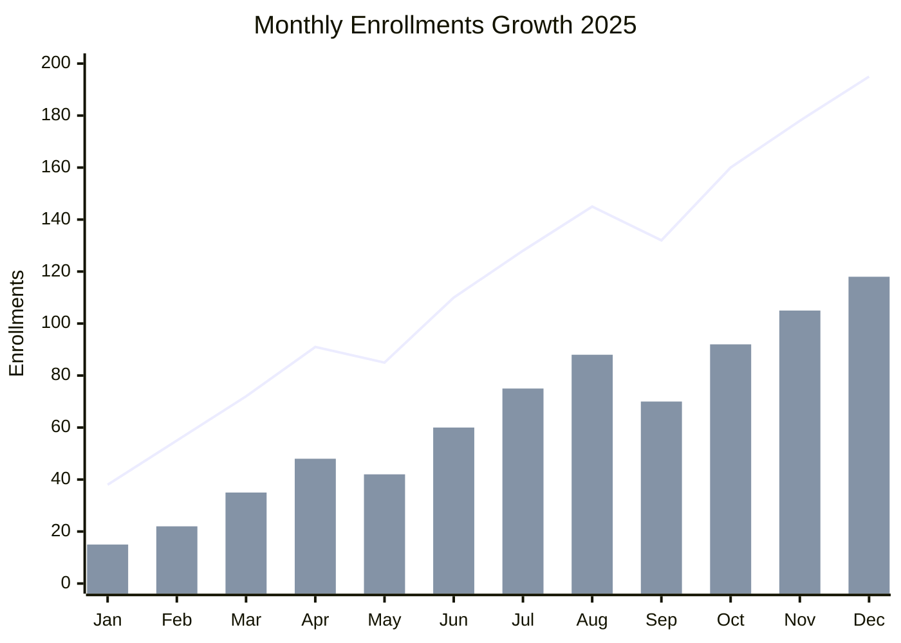

### Academy Distribution by Curriculum

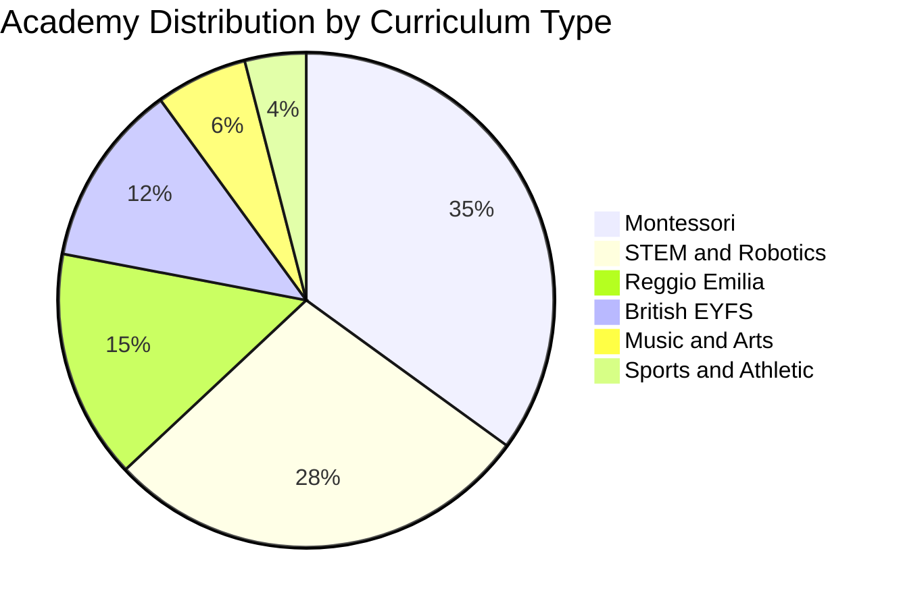

### Revenue Growth

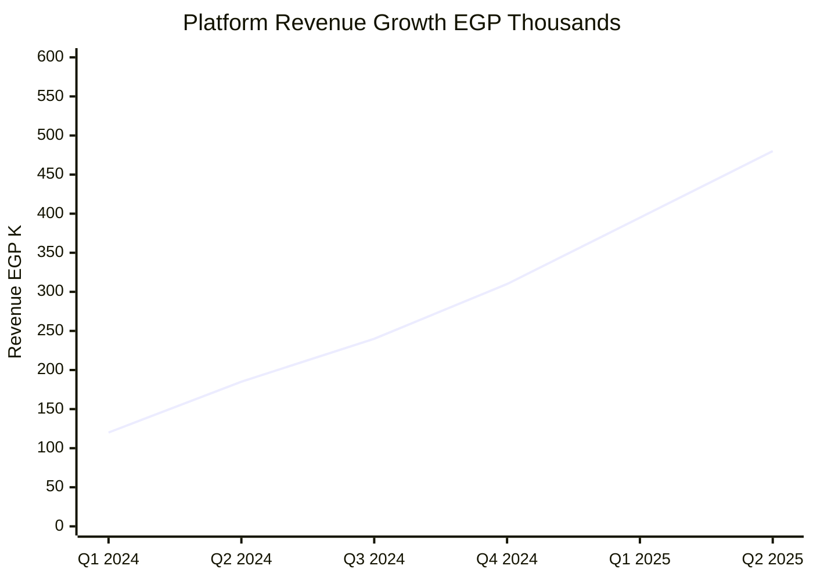

### User Role Distribution

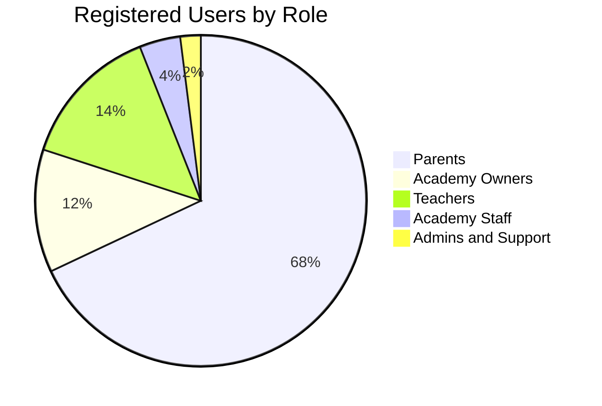

### Enrollment by Child Age Group


---

## 🗄️ Data Models

### User Schema
```typescript
{
  firstName: string           // required
  lastName: string            // required
  email: string               // unique, indexed
  passwordHash: string        // bcrypt salt=12
  role: UserRole              // guest|parent|teacher|nurseryOwner|academyStaff|support|admin|superAdmin
  gender: 'male' | 'female'
  phoneNumber: string
  address: string
  avatar: string              // Cloudinary or Unsplash URL
  isActive: boolean
  isVerified: boolean
  failedLoginAttempts: number // brute-force counter
  lockUntil?: Date
  refreshTokens: string[]     // rotating JWT refresh tokens
  googleProfile?: { id, email, name, picture }
  isMfaEnabled: boolean
  mfaSecret?: string          // encrypted TOTP secret
  createdAt, updatedAt
}
```

### Academy Schema
```typescript
{
  ownerId: ObjectId           // ref: User (nurseryOwner)
  name: string                // text-indexed
  description: string         // text-indexed
  logo: string                // Cloudinary CDN URL
  rating: number              // 0-5, indexed
  totalReviews: number
  curriculum: string          // Montessori|STEM|Reggio Emilia|British EYFS
  languages: string[]
  activities: string[]
  minAgeAllowed: number
  maxAgeAllowed: number
  price: number               // monthly tuition EGP
  isVerified: boolean         // admin-approved badge
  reviews: [{ userName, userAvatar, rating, comment, createdAt }]
  createdAt, updatedAt
}
```

### Enrollment Schema
```typescript
{
  parentId: ObjectId          // ref: User
  academyId: ObjectId         // ref: Academy
  childId?: ObjectId          // ref: Child
  programId?: ObjectId        // ref: Course
  status: 'pending' | 'approved' | 'rejected' | 'cancelled' | 'active'
  paymentStatus: 'unpaid' | 'paid' | 'partial'
  startDate?: Date
  notes?: string
  createdAt, updatedAt
}
```

---

## 🔐 Security Architecture

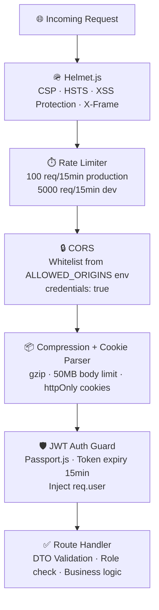

| Feature | Implementation |
|---------|---------------|
| Password Hashing | bcrypt, salt=12 |
| Access Token | JWT, 15 min expiry |
| Refresh Token | Rotating JWT, 30 days |
| Token Storage | httpOnly cookies (XSS-proof) |
| Google SSO | OAuth 2.0 + Passport.js |
| MFA | TOTP via speakeasy + QR code |
| Brute Force | Failed attempts counter + lock |
| Rate Limiting | 100 req/15min (production) |
| Security Headers | Helmet.js (CSP, HSTS, etc.) |
| Data Validation | class-validator whitelist DTOs |

---

## 🚀 Deployment & CI/CD

### Production URLs

| Service | URL |
|---------|-----|
| **Frontend** | [kids-oasis-platform.vercel.app](https://kids-oasis-platform.vercel.app) |
| **API v1** | [kids-oasis-api.vercel.app/api/v1](https://kids-oasis-api.vercel.app/api/v1) |
| **Swagger** | [kids-oasis-api.vercel.app/swagger](https://kids-oasis-api.vercel.app/swagger) |

### CI/CD Pipeline

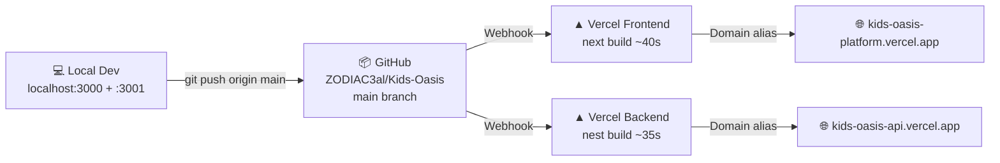

---

## ⚙️ Environment Variables

### Frontend (`frontend/.env`) — Vercel Production
```bash
NEXT_PUBLIC_API_URL=https://kids-oasis-api.vercel.app/api/v1
NEXT_PUBLIC_WS_URL=https://kids-oasis-api.vercel.app
NEXT_PUBLIC_STRIPE_PUBLISHABLE_KEY=pk_test_...
NEXT_PUBLIC_CLOUDINARY_CLOUD_NAME=...
NEXT_PUBLIC_GOOGLE_CLIENT_ID=...
```

### Frontend Local Dev (`frontend/.env.local`) — git-ignored
```bash
NEXT_PUBLIC_API_URL=http://localhost:3001/api/v1
NEXT_PUBLIC_WS_URL=http://localhost:3001
```

### Backend (`backend/.env`)
```bash
MONGODB_URI=mongodb+srv://...
JWT_SECRET=...
JWT_REFRESH_SECRET=...
GOOGLE_CLIENT_ID=...
GOOGLE_CLIENT_SECRET=...
GOOGLE_CALLBACK_URL=https://kids-oasis-api.vercel.app/api/v1/auth/google/callback
FRONTEND_URL=https://kids-oasis-platform.vercel.app
STRIPE_SECRET_KEY=sk_test_...
CLOUDINARY_CLOUD_NAME=...
CLOUDINARY_API_KEY=...
CLOUDINARY_API_SECRET=...
SMTP_HOST=... SMTP_PORT=587 SMTP_USER=... SMTP_PASS=...
NODE_ENV=production
```

---

## 🛠️ Local Development

```bash
# 1. Clone
git clone https://github.com/ZODIAC3al/Kids-Oasis.git
cd Kids-Oasis

# 2. Local MongoDB (optional)
docker-compose up -d

# 3. Backend
cd backend && npm install
cp .env.example .env   # fill your values
npm run start:dev      # http://localhost:3001
# Swagger: http://localhost:3001/swagger

# 4. Frontend (new terminal)
cd frontend && npm install
echo "NEXT_PUBLIC_API_URL=http://localhost:3001/api/v1" > .env.local
npm run dev            # http://localhost:3000

# 5. Seed sample data
cd backend && npm run seed
```

---

## 📁 Project Structure

```
Kids-Oasis/
├── backend/
│   └── src/
│       ├── academies/      # CRUD + Pagination + Geo-search
│       ├── auth/           # JWT + Google OAuth + MFA
│       ├── bookings/       # Visits + Enrollments workflow
│       ├── chat/           # Socket.io WebSocket
│       ├── children/       # Child profiles
│       ├── cloudinary/     # Image upload
│       ├── enrollments/    # Enrollment service
│       ├── newsletter/     # Email subscriptions
│       ├── payments/       # Stripe integration
│       ├── site/           # Public content API
│       ├── users/          # User management
│       ├── main.ts         # Bootstrap + Swagger + Security
│       └── seed.ts         # Database seeder
├── frontend/
│   └── src/
│       ├── app/[locale]/   # i18n routes EN + AR
│       │   ├── academies/  # Browse + Detail + Compare
│       │   ├── dashboard/
│       │   │   ├── parent/   # Parent portal
│       │   │   ├── academy/  # Academy management + analytics
│       │   │   ├── teacher/  # Teacher roster
│       │   │   └── admin/    # Admin panel + audit logs
│       │   └── ...
│       ├── components/     # Shared UI components
│       ├── lib/config.ts   # API URL configuration
│       ├── store/          # Redux Toolkit
│       └── middleware.ts   # Auth + locale routing
│   ├── messages/
│   │   ├── en.json         # English translations
│   │   └── ar.json         # Arabic RTL translations
├── .agents/skills/
│   ├── kids-oasis-design/  # Design system AI skill
│   └── kids-oasis-enterprise/ # Architecture AI skill
├── docker-compose.yml
└── README.md
```

---

## 🌍 Internationalization

| Language | Code | Layout | Status |
|----------|------|--------|--------|
| English | `en` | LTR | ✅ Full support |
| Arabic | `ar` | **RTL** | ✅ Full RTL with mirrored layout |

---

<div align="center">

**Built with ❤️ for Egyptian families and educators**

[🌐 Live Demo](https://kids-oasis-platform.vercel.app) · [📚 API Docs](https://kids-oasis-api.vercel.app/swagger) · [🐛 Issues](https://github.com/ZODIAC3al/Kids-Oasis/issues)

</div>
